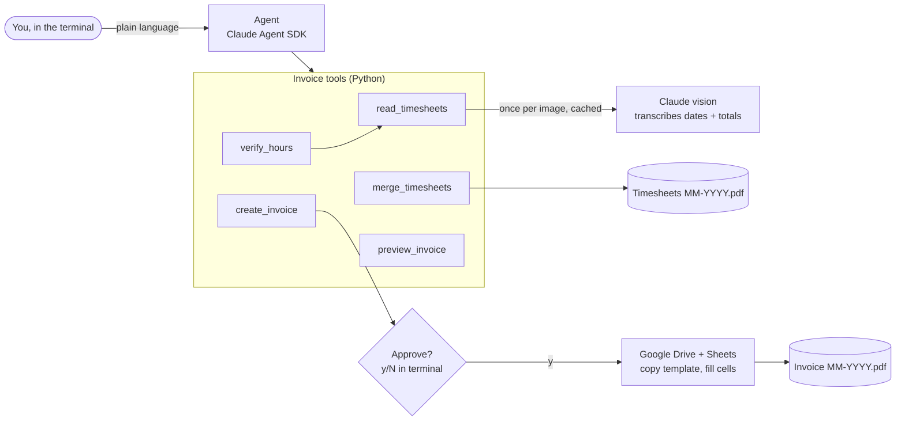

# Invoice Agent

A small agent that does my monthly contractor invoicing. I describe the month in plain language, and it:

1. **Reads** each weekly timesheet screenshot with Claude vision.
2. **Checks** the weekly totals I typed against what the screenshots show.
3. **Merges** the screenshots into one timesheet PDF, earliest week first.
4. **Fills in** a copy of my Google Sheets invoice template and exports it as a PDF, but only after I approve it in the terminal.

It's built on the [Claude Agent SDK](https://code.claude.com/docs/en/agent-sdk), with every step also available as a plain CLI command.

## Example session

This runs on the demo data in [`examples/`](examples/): fake screenshots and a fake template. The invoice preview is real program output; the agent's chat replies are abridged.

```text
$ uv run invoice-agent agent
you> April 2026: 22h 05m, 23h 30m, 25h 40m, 26h 30m, 25h 35m. Screenshots are in data/demo-2026-04.
  [verify_hours]
  [merge_timesheets]
  [preview_invoice]
  [create_invoice]

Invoice plan: 'Invoice April 2026' (copy of template 1AbCdEf...)
  B9    Submitted on 4/30/2026
  F12   04-2026
  F16   46142
        (due date shows as 4/30/2026)
  B20   April 1-5            E20   16.58
  B21   April 6-12           E21   23.5
  B22   April 13-19          E22   25.67
  B23   April 20-26          E23   26.5
  B24   April 27-30          E24   22.33
  row 25 cleared (blank description, 0 hours)
  Total hours: 114.58  (the sheet's formulas compute the amounts)
  PDF: data/demo-2026-04/Invoice 04-2026.pdf

Create 'Invoice April 2026'? [y/N] y

agent> Done. All five weeks matched your screenshots. The invoice is at
       https://docs.google.com/spreadsheets/d/.../edit, and both PDFs are in data/demo-2026-04.
```

The first week runs Mon Mar 30 to Sun Apr 5. I typed the screenshot's full weekly total, 22h 05m. The tool worked out that 16h 35m of it falls in April, which is 16.58 on the invoice. The last week runs Mon Apr 27 to Sun May 3, so the Friday, May 1 hours are left for May's invoice.

## How it works



### Design decisions

- **Claude transcribes, code calculates.** The vision call only copies text off the screenshot: dates, and values like `"1h 30m"` from the Total row, using structured output. Python does all the parsing, sums and month clipping. It also cross-checks every reading: seven consecutive days starting on a Monday, and daily totals that add up to the weekly total.
- **An independent check, not a copy.** I type each week's total myself, and the tool compares it to the screenshot to the minute. The agent is told never to fill in the hours from the screenshots, since that would defeat the check.
- **Approval is enforced in code, not in the prompt.** `create_invoice` is the only tool that changes anything outside this folder. The safeguards:
  - It isn't on the SDK's auto-approve list, and the permission mode is pinned to `default`.
  - Every call goes to an approval callback that prints the exact plan and asks `y/N`.
  - The tool itself refuses unless that exact request was approved, and each approval works only once.
  - Requests that don't verify are rejected before you're asked.
- **Least privilege throughout.**
  - The agent has none of Claude Code's built-in tools (`tools=[]`): no shell, no file editing, no web.
  - The tools only touch folders inside `data/`.
  - Your personal Claude Code settings aren't loaded.
  - Google access is read-only Drive plus the files the app creates, so it can copy the template but can't change or delete anything else.
- **Plan, then apply.** `plan_invoice` works out every cell value as plain data. The dry run, the approval prompt and the real run all use that same plan, so what you approve is what gets written.
- **Read each screenshot only once.** Readings are cached next to each image and reused until the image changes, so re-running a month costs about a cent of agent time.

## Try the demo

The repo includes fake data, so you can try everything without your own timesheets:

- `examples/timesheets/`: five weekly screenshots for April 2026. The projects and hours are made up, and the filenames are capture times, deliberately not in week order. To regenerate them, run `scripts/make_demo_screenshots.py`.
- `examples/invoice-template.xlsx`: an invoice template with fake contact details and a $100/hour rate.

```bash
cp -R examples/timesheets data/demo-2026-04
uv run invoice-agent read    data/demo-2026-04 --month 2026-04
uv run invoice-agent verify  data/demo-2026-04 --month 2026-04 --hours "22h 05m, 23h 30m, 25h 40m, 26h 30m, 25h 35m"
uv run invoice-agent merge   data/demo-2026-04 --month 2026-04
uv run invoice-agent invoice data/demo-2026-04 --month 2026-04 --hours "22h 05m, 23h 30m, 25h 40m, 26h 30m, 25h 35m" --dry-run
```

Reading the screenshots takes an Anthropic API key and costs a few cents. Everything after that runs from the cached readings. To create a real invoice from the demo:
1. Upload `examples/invoice-template.xlsx` to Google Drive.
2. Open it with Google Sheets and choose **File > Save as Google Sheets**.
3. Use that sheet's ID as `template_id` (see [Google setup](#google-setup-one-time)).

To see the agent catch a mistake, change one of the weekly totals.

## Quick start

You'll need Python 3.12+, [uv](https://docs.astral.sh/uv/), and an [Anthropic API key](https://console.anthropic.com/). Creating invoices also needs a Google Cloud project; see [Google setup](#google-setup-one-time).

```bash
git clone https://github.com/biancanoel/invoice-agent.git
cd invoice-agent
uv sync
cp .env.example .env                 # add ANTHROPIC_API_KEY
cp config.example.toml config.toml   # add your template and folder IDs
```

Put a month's screenshots in `data/YYYY-MM/`, then either chat with the agent:

```bash
uv run invoice-agent agent
```

or run each step yourself:

```bash
uv run invoice-agent weeks   --month 2026-10                  # the month's invoice weeks
uv run invoice-agent read    data/2026-10 --month 2026-10     # what Claude read from each screenshot
uv run invoice-agent verify  data/2026-10 --month 2026-10 --hours "15h 20m, 12h, 9h 30m, 10h 15m, 8h 05m"
uv run invoice-agent merge   data/2026-10 --month 2026-10     # Timesheets 10-2026.pdf
uv run invoice-agent invoice data/2026-10 --month 2026-10 --hours "..." --dry-run
uv run invoice-agent invoice data/2026-10 --month 2026-10 --hours "..."   # asks y/N, then creates
```

`--hours` takes one entry per week, earliest first. Each entry is **the weekly total from the bottom-right of that week's screenshot**, typed as shown (`40m`, `1h 30m`, `15h 20m`). Decimals like `1.5` also work.

## Invoice rules

- **Weeks** run Monday to Sunday, like the timesheet app. Each invoice line is one week clipped to the month, e.g. `October 1-4`, `October 5-11`, …, `October 26-31`.
- A week that spans two months appears in both months' timesheet PDFs. Each invoice counts only its own month's days.
- **Invoice number** is `MM-YYYY`. **Submitted on** and **Due date** are the last day of the month.
- Hours on the invoice are decimals to 2 places (40 minutes → 0.67). The rate and all amounts come from the template's own formulas.
- If this month's invoice already exists in the Drive folder, it refuses to create a second one.
- Screenshot filenames record the capture time, not the week shown, so they're never used for ordering.

## Agent tools

| Tool | What it does | Runs without asking? |
|---|---|---|
| `read_timesheets` | Shows each screenshot's week, daily totals, and time inside the month | yes |
| `verify_hours` | Checks your weekly totals against the screenshots | yes |
| `merge_timesheets` | Writes `Timesheets MM-YYYY.pdf` | yes |
| `preview_invoice` | Shows exactly what would be written (dry run) | yes |
| `create_invoice` | Copies the template, fills it in, saves the PDF | **no: you approve each call** |

- **Instructions:** the agent's instructions are in [`src/invoice_agent/prompts/system.md`](src/invoice_agent/prompts/system.md).
- **Model:** set by `agent_model` in `config.toml` (default `claude-sonnet-5-5`).
- **Limits:** each session is capped at $2 and 40 turns, and the cost prints when you exit.

## Google setup (one time)

1. **Make a dedicated template.** In Drive, open an existing invoice and choose **File > Make a copy**. Name it e.g. `Invoice Template` and keep it unused.
2. **Create a Google Cloud project** at [console.cloud.google.com](https://console.cloud.google.com/). No billing is needed.
3. **Turn on the APIs.** Under **APIs & Services > Library**, enable **Google Drive API** and **Google Sheets API**.
4. **Set up the consent screen.** Under **Google Auth Platform**, choose audience **External** and add your own Google account as a **test user**.
5. **Create the client.** Under **Clients**, create a **Desktop app** client, download its JSON, and save it here as `credentials.json`.
6. **Fill in the config.** In `config.toml`, set `template_id` (from the template's URL) and `folder_id` (from the Drive folder's URL). If your template's cells differ from the defaults, adjust the `[layout]` section.

The first invoice run opens a browser to approve access. Google shows "Google hasn't verified this app" because it's your own app; continue past it. While the app is in testing mode, Google expires the sign-in after 7 days, so expect to approve again about once a month.

`.env`, `config.toml`, `credentials.json`, `token.json` and `data/` are all gitignored.

## Project layout

```text
src/invoice_agent/
  agent.py              Agent SDK tools, approval gate, terminal chat
  prompts/system.md     the agent's instructions
  cli.py                command-line entry point (parsing and printing only)
  timesheet.py          Claude vision transcription + per-image cache
  verify.py             typed totals vs. screenshots
  merge.py              timesheet PDF
  invoice.py            plan_invoice (pure) and create_invoice
  google_auth.py        Google sign-in
  google_workspace.py   Drive/Sheets calls
  weeks.py              Monday-Sunday billing weeks
  durations.py          "1h 30m" <-> minutes <-> invoice hours
  report.py             text output shared by the CLI and the agent
  config.py             config.toml loading and template layout
examples/               fake screenshots and template for the demo
scripts/                make_demo_screenshots.py
```

## Tests

```bash
uv run pytest
```

There are 137 tests, all offline. The Claude API, Google APIs and terminal input are replaced with fakes. They cover:
- week and duration math, including months that start mid-week and weeks that span two months
- PDF merging and ordering
- screenshot parsing, consistency checks and caching
- verification statuses
- the exact cells written to the invoice
- every outcome of the agent's approval gate and folder limits

## Status

- [x] **Phase 1:** tools as a CLI (read, verify, merge, invoice)
- [x] **Phase 2:** agent on the Claude Agent SDK
- [x] **Phase 3:** demo data, a dummy template, and a code review pass
